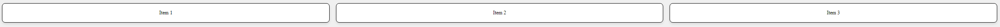
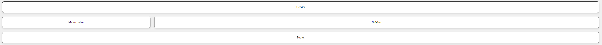

# Layouts en CSS

El diseño de layouts es una habilidad fundamental en CSS que implica estructurar y organizar visualmente el contenido de una página web.

## Conceptos Clave
- **Display**: Propiedad que define cómo se muestra un elemento, incluyendo `block`, `inline`, `flex`, y `grid`.
- **Position**: Controla cómo se posicionan los elementos en la página, con valores como `static`, `relative`, `absolute`, y `fixed`.
- **Flexbox**: Sistema unidimensional que gestiona espacios y alineación de elementos en un contenedor flexible.
- **CSS Grid**: Sistema bidimensional que permite crear complejas estructuras de diseño con filas y columnas.
- **Responsive Design**: Prácticas que aseguran que tu layout funcione en diferentes tamaños de pantalla, utilizando técnicas como media queries.


```html
<div class="contenedor-flex">
  <div class="elemento-flex">Item 1</div>
  <div class="elemento-flex">Item 2</div>
  <div class="elemento-flex">Item 3</div>
</div>
```
```css
.contenedor-flex {
  display: flex;
  justify-content: space-around;
}
.elemento-flex {
  flex: 1;
}

```

Este ejemplo muestra un contenedor flex con tres elementos que se distribuyen con espacio alrededor.

Nota: la imagen tiene mas estilos aplicados pero es para que veias como seria. 



## Ejemplo de Uso de Grid

CSS Grid permite crear complejas estructuras de diseño de página con filas y columnas.

```html 
<div class="contenedor-grid">
  <div class="elemento-grid">Header</div>
  <div class="elemento-grid">Main content</div>
  <div class="elemento-grid">Sidebar</div>
  <div class="elemento-grid">Footer</div>
</div>
```
```css
.contenedor-grid {
  display: grid;
  grid-template-columns: 1fr 3fr;
  grid-template-rows: auto;
  gap: 10px;
}
.elemento-grid {
  border: 1px solid #333;
}
``` 
Este fragmento crea un layout básico de página con un header, contenido principal, sidebar y footer.

Nota: la imagen tiene mas estilos aplicados pero es para que veias como seria. 



## Consejos Adicionales

- Utiliza unidades relativas como `%`, `vw`, `vh`, `em`, o `rem` para tamaños y espacios para mejorar la flexibilidad y la respuesta del diseño.
- Experimenta con diferentes valores de `align-items` y `justify-content` en Flexbox para ver cómo afectan el alineamiento y distribución de los elementos.
- Para CSS Grid, practica con `grid-template-areas` para un manejo más visual de las áreas de tu grid.

## Recursos Adicionales

- [A Complete Guide to Flexbox](https://css-tricks.com/snippets/css/a-guide-to-flexbox/)
- [A Complete Guide to Grid](https://css-tricks.com/snippets/css/complete-guide-grid/)
- [Learn CSS Layout](https://learnlayout.com/)
