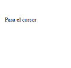

# Animaciones en CSS

Las animaciones añaden interactividad y dinamismo a las páginas web, mejorando la experiencia del usuario.

## Ejemplo de Animación Simple
Una animación que cambia el color de fondo de un elemento cuando el usuario pasa el cursor sobre él.

```css
.elemento-animado:hover {
  animation: cambio-color 2s infinite;
}

@keyframes cambio-color {
  0% { background-color: #ffffff; }
  100% { background-color: #0000ff; }
}

```
Al pasar el cursor sobre .elemento-animado, el fondo cambiará entre blanco y azul.




## Consejos Adicionales

- Mantén las animaciones simples y sutiles para no distraer demasiado al usuario.
- Usa `will-change` para optimizar las animaciones, pero con precaución y solo cuando sea necesario.
- Considera las implicaciones de accesibilidad de las animaciones y proporciona controles para que los usuarios las detengan si lo necesitan.

## Recursos Adicionales

- [CSS Animations on MDN](https://developer.mozilla.org/en-US/docs/Web/CSS/CSS_Animations/Using_CSS_animations)
- [CSS Tricks on Animation](https://css-tricks.com/almanac/properties/a/animation/)
- [Animation Performance 101](https://www.smashingmagazine.com/2016/12/gpu-animation-doing-it-right/)
