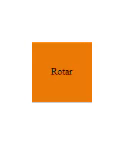
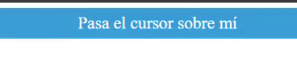

# Estilos Avanzados en CSS

Los estilos avanzados permiten crear diseños únicos y atractivos, utilizando propiedades como transformaciones, transiciones y pseudo-elementos.

## Ejemplo de Transformación
Aplica una rotación a un elemento cuando se pasa el cursor sobre él.

```css
.elemento-transformado:hover {
  transform: rotate(45deg);
}

```
Este estilo rotará el elemento 45 grados al pasar el cursor.




## Ejemplo de Transformaciones
Las transformaciones permiten modificar la apariencia de los elementos, aplicando escalado, rotación y traslados.

```css
.elemento-transformado {
  transition: transform 0.5s ease-in-out;
}
.elemento-transformado:hover {
  transform: scale(1.1);
}
``` 

Este estilo aumentará el tamaño del elemento en un 10% al pasar el cursor.



## Consejos para Profundizar
- Experimenta con diferentes valores y combinaciones de filtros para lograr efectos únicos.
- Usa transformaciones para crear interacciones dinámicas y animaciones llamativas.
- Aprende a utilizar pseudo-elementos como ::before y ::after para añadir elementos estilísticos sin HTML adicional.

## Consejos Adicionales

- Experimenta con propiedades como `box-shadow` y `text-shadow` para añadir profundidad a tus diseños.
- Utiliza `:before` y `:after` para añadir elementos decorativos sin necesidad de HTML adicional.
- Prueba con diferentes funciones de transición (`ease`, `linear`, `ease-in-out`, etc.) para ver cómo afectan la sensación de la animación.

## Recursos Adicionales

- [Advanced CSS Techniques](https://www.smashingmagazine.com/2009/08/taming-advanced-css-selectors/)
- [CSS3 Transitions And Transforms From Scratch](https://www.smashingmagazine.com/2016/05/fluid-responsive-typography-css-poly-fluid-sizing/)
- [Using CSS Pseudo-elements and Pseudo-classes](https://developer.mozilla.org/en-US/docs/Web/CSS/Pseudo-classes)
